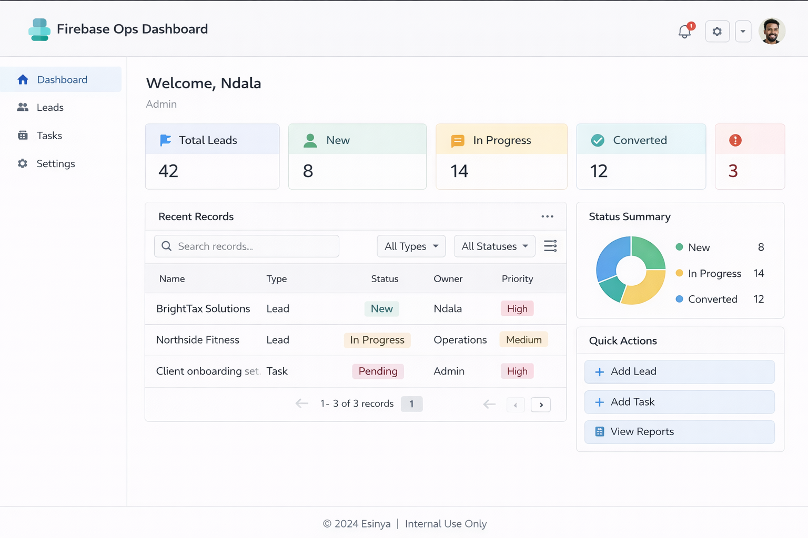

# Firebase Ops Dashboard

Internal operations dashboard demo built with Firebase for small business workflows.

## What it does

This project demonstrates a lightweight internal dashboard that helps a business manage operations in one place.

It is designed to show how a company could:

- track leads, tasks, or orders
- manage operational records
- view key metrics in a dashboard
- use Firebase for authentication and data storage
- provide a simple admin interface for internal use

## Example use cases

- internal admin dashboard
- lead management dashboard
- task or workflow tracker
- client onboarding tracker
- simple operations control panel

## Example workflow

1. Team member logs in
2. Dashboard loads key business metrics
3. User views records such as leads, tasks, or orders
4. User updates statuses or assigns work
5. Data is stored and reflected in the dashboard
6. Business gets a cleaner view of operations

## Dashboard Preview

## Business value

Many small businesses run important operations through spreadsheets, inboxes, and scattered notes.

This demo shows how a lightweight internal dashboard can improve visibility, reduce admin friction, and create a cleaner workflow for day-to-day operations.

## Core features

- dashboard summary cards
- record list or table
- status tracking
- basic filtering
- Firebase authentication
- Firestore-backed data structure
- role-aware internal workflow direction

## Stack direction

- Firebase Authentication
- Firestore
- modern web frontend
- optional Cloud Functions
- optional notifications or integrations

## Project Files

- [Workflow overview](docs/overview.md)
- [Dashboard metrics sample](sample-data/dashboard-metrics.json)
- [Example records](sample-data/example-records.json)
- [Feature list](features/dashboard-features.md)
- [Firebase notes](architecture/firebase-notes.md)

## Notes

This is a public showcase project intended to demonstrate internal tool design and implementation capability.
No real client data, secrets, or private infrastructure details are included.

## Contact

Built by Ndala  
For freelance or consulting work: `ndalabuilds@esinya.com`
